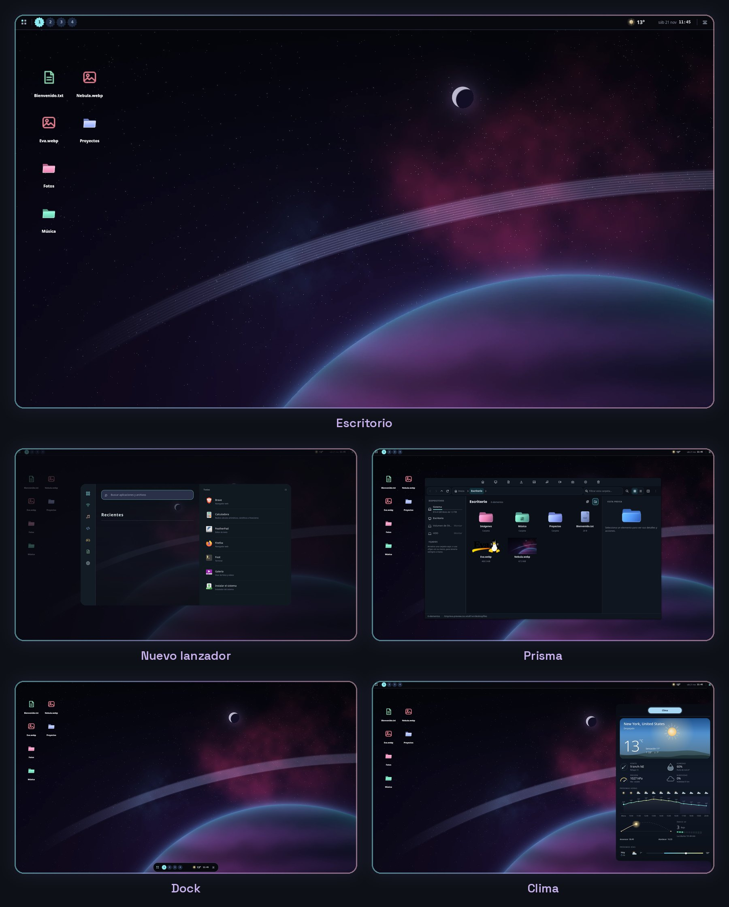
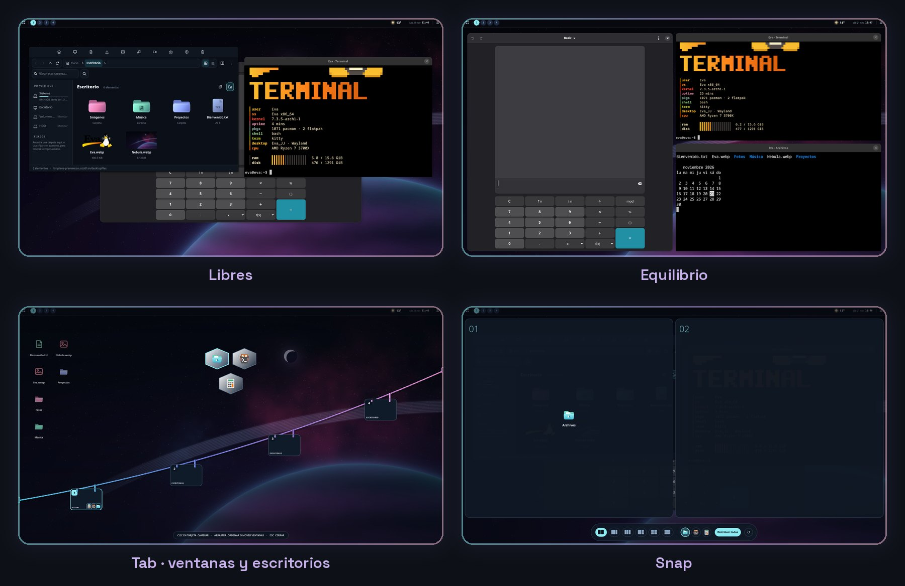
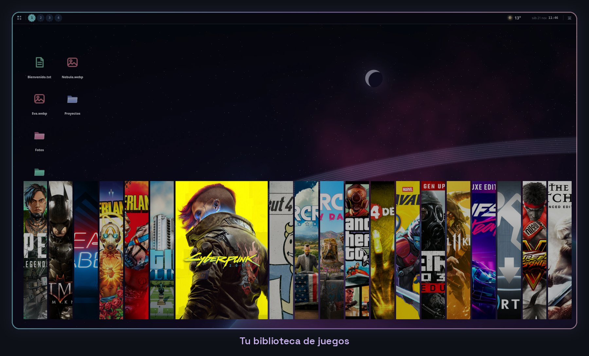
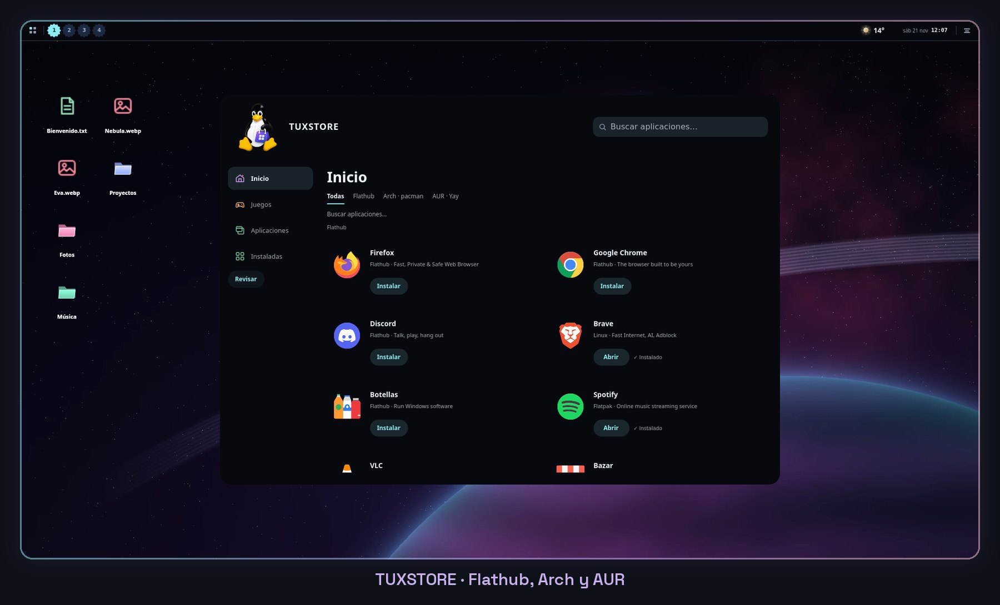
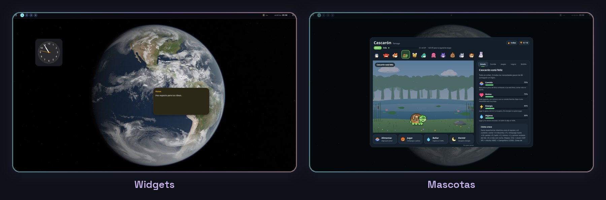
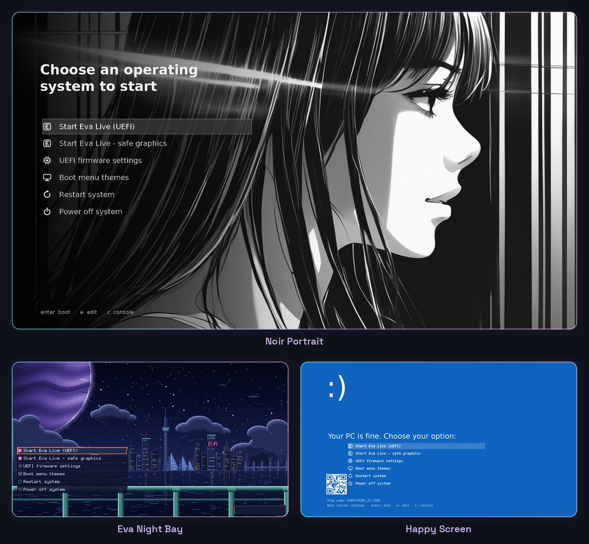

<a href="https://github.com/2207juan/EVA/blob/main/docs/es/README.md">Español</a> &nbsp; · &nbsp; <a href="https://github.com/2207juan/EVA/blob/main/docs/en/README.md">English</a>

<picture>
  <source media="(max-width: 600px)" srcset="assets/design/cover-mobile-es.svg?v=20261121-eva-clean"/>
  
</picture>

     

